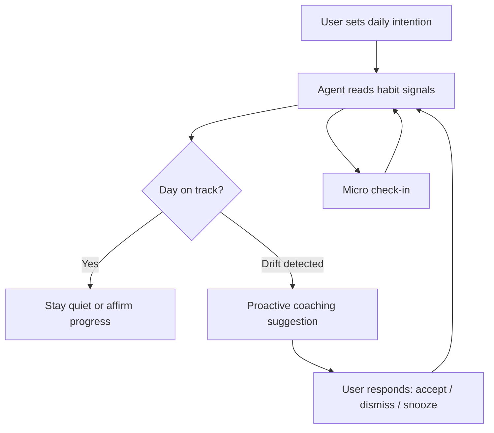

# Agentic Productivity Coach — Requirements

## Summary

Build an agentic productivity coach for individuals that unifies daily priorities and habits in one loop. Users set a light daily intention; the agent reads habit signals and proactively suggests focus and adjustments so days feel more intentional. Prove the coaching loop first — mobile interface and deep life-context integrations come later.

---

## Problem Frame

Many individuals struggle with two linked failures: they cannot decide what matters today, and the habits that would support those priorities do not stick. Existing tools often split these problems — todo apps for tasks, habit trackers for streaks — without connecting them. Users end up with scattered lists, ambitious morning plans that collapse by afternoon, or restart cycles every few weeks when a new system fades out.

The cost is not just missed tasks. Days feel reactive and unintentional. People know what they *should* do but lack a system that adapts when energy, timing, or follow-through drifts. A passive tracker records failure after the fact; what is missing is a coach that notices patterns and intervenes while the day can still be salvaged.

This product targets broader individuals, not a single personal workflow. The first bet is an integrated, agentic loop — not another static dashboard.

---

## Key Decisions

- **Core capability before mobile UI** — The coaching loop (intention → signals → proactive guidance) must deliver value before investing in a polished mobile experience. Interface is a delivery layer, not the product thesis.

- **Proactive coach, not executor** — The agent observes, suggests, and adapts. It does not take external actions on the user's behalf (scheduling, sending messages, drafting emails) in v1.

- **Habit signals as primary context** — v1 centers on streaks, missed routines, and time-of-day patterns rather than deep calendar, task, or email integration. This keeps the first version focused and proves the coaching model faster.

- **Hybrid priorities** — Users set a light daily intention explicitly. The agent adjusts coaching based on habit signals; it does not fully infer priorities nor require heavy manual planning.

- **Micro check-in learning model (Approach 3)** — Brief periodic check-ins plus habit-signal observation let the agent learn when someone typically follows through or slips. Coaching sharpens over days, not from day one.

- **Success = intentional days** — After one week, the primary signal of success is that days feel more intentional and users follow through on what mattered — not merely longer streak counts or more app opens.

---

## Actors

- A1. **Individual user** — A busy person juggling competing demands who wants their day to feel intentional. Sets a light daily intention, tracks or confirms habits, and responds to coach suggestions.

- A2. **Productivity coach agent** — An agentic system that reads habit signals, learns timing patterns from check-ins, and proactively suggests focus, adjustments, or recovery when intention and behavior diverge.

---

## Key Flows

- F1. **Morning intention**
  - **Trigger:** Start of the user's day (or first app/session open).
  - **Actors:** A1, A2
  - **Steps:** User sets 1–3 intentions for what would make today feel successful. Agent acknowledges intentions and surfaces any habit windows relevant to those intentions based on known patterns.
  - **Outcome:** A lightweight plan anchors the day without heavy planning overhead.
  - **Covered by:** R1, R2, R3

- F2. **Habit signal observation**
  - **Trigger:** Continuous / background during the day as habit events occur or are missed.
  - **Actors:** A2
  - **Steps:** Agent tracks streak status, completed or missed routines, and time-of-day patterns. Signals accumulate into a picture of whether the day is on track relative to intention.
  - **Outcome:** Agent has enough context to coach proactively without requiring constant user input.
  - **Covered by:** R4, R5

- F3. **Proactive coaching intervention**
  - **Trigger:** Detected drift — missed habit window, streak at risk, or gap between intention and observed behavior.
  - **Actors:** A1, A2
  - **Steps:** Agent surfaces a timely, specific suggestion (protect focus, reschedule a habit, simplify remaining intentions). User accepts, dismisses, or snoozes. Agent records the response to refine future timing.
  - **Outcome:** User recovers intentional direction before the day is lost.
  - **Covered by:** R6, R7, R8

- F4. **Micro check-in**
  - **Trigger:** Scheduled lightweight prompt or end-of-habit-window check.
  - **Actors:** A1, A2
  - **Steps:** User completes a brief check-in (~30 seconds): energy, progress on intention, habit status. Agent updates its model of when this user typically follows through.
  - **Outcome:** Coaching becomes more personalized over successive days.
  - **Covered by:** R9, R10

---

## Requirements

**Daily intention**

- R1. The user can set a light daily intention covering 1–3 outcomes that would make today feel successful.
- R2. Setting intention requires minimal effort — completable in under two minutes without structuring a full task list.
- R3. The agent references the user's stated intention when generating coaching suggestions.

**Habit signals**

- R4. The system tracks habit completion, missed routines, and streak status as first-class signals.
- R5. The system captures time-of-day patterns associated with habit success and failure for each user over time.

**Proactive coaching**

- R6. The agent proactively surfaces coaching suggestions when habit signals indicate drift from the user's daily intention.
- R7. Coaching suggestions are specific and actionable — tied to the user's intention and observed pattern, not generic motivational messages.
- R8. The user can accept, dismiss, or snooze a coaching suggestion; the agent incorporates the response into future timing and relevance.

**Learning loop**

- R9. The system offers brief micro check-ins that the user can complete in approximately 30 seconds.
- R10. Coaching relevance improves over multiple days as the agent accumulates habit signals and check-in responses.

**Experience principles**

- R11. The agent defaults to respectful intervention — quiet when the user is on track, proactive when drift is detected.
- R12. The core coaching loop delivers standalone value without requiring a mobile app interface in v1.

---

## Acceptance Examples

- AE1. **Morning intention anchors coaching**
  - **Covers:** R1, R3, R6
  - **Given:** User sets intention "Finish project outline before lunch."
  - **When:** User misses their usual morning focus habit by 10am.
  - **Then:** Agent suggests protecting the next available window for the outline, referencing the stated intention.

- AE2. **Quiet when on track**
  - **Covers:** R11
  - **Given:** User's habits are on streak and behavior aligns with today's intention.
  - **When:** Midday signal check runs.
  - **Then:** Agent does not send a nudge unless the user requests check-in.

- AE3. **Dismissed suggestion reduces repeat noise**
  - **Covers:** R8, R11
  - **Given:** User dismisses a coaching suggestion about rescheduling a habit.
  - **When:** Similar drift occurs later the same day.
  - **Then:** Agent does not repeat the same suggestion immediately; it adapts timing or framing.

- AE4. **Learning from check-ins**
  - **Covers:** R5, R9, R10
  - **Given:** User consistently reports low energy after 3pm across three check-ins.
  - **When:** Agent detects intention drift in the late afternoon.
  - **Then:** Suggestion accounts for the learned low-energy window (e.g., simplify remaining intentions rather than push a heavy habit).

---

## Success Criteria

- SC1. After one week of use, users report that days feel more intentional — not merely that they opened the app or logged habits.

- SC2. Users follow through on at least one stated daily intention on most days within the first week.

- SC3. Coaching suggestions are rated relevant or helpful more often than annoying or intrusive (qualitative threshold to be defined during planning).

- SC4. The core loop (intention → signals → coaching) is demonstrable without a mobile app shell.

---

## Scope Boundaries

**Deferred for later**

- Polished mobile app interface as the primary delivery surface
- Deep integration with calendar, email, and external task systems
- Agent-as-executor behaviors (scheduling, drafting, sending on user's behalf)
- Social, team, or manager-facing productivity features

**Outside this product's identity**

- A generic todo list or project management tool
- A passive habit tracker without proactive coaching
- Enterprise workforce analytics or manager dashboards
- Building exclusively for one person's personal workflow

---

## Dependencies / Assumptions

- A1. Users will engage with a brief morning intention step most days — without it, the hybrid priority model weakens.

- A2. Habit signals alone provide enough context for v1 coaching to feel useful within the first week, even before deep integrations exist.

- A3. Users tolerate lightweight check-ins if coaching quality visibly improves within a few days.

- A4. "Habits" span multiple life domains (work, health, learning, personal) unless narrowed during planning — the coach must handle domain-agnostic habit definitions in v1.

---

## Outstanding Questions

**Resolve before planning**

- OQ1. **Primary user segment** — Who is the first user? (Working professionals, freelancers, students, or general adults?) This affects example habits, check-in timing defaults, and onboarding tone.

- OQ2. **Habit domain scope for v1** — Should the coach support all-of-life habits, or launch with one domain (e.g., work focus + health) to keep signal interpretation simpler?

**Deferred to planning**

- OQ3. Minimum habit count and types needed before coaching feels intelligent on day one vs. day three.

- OQ4. Default check-in frequency and timing without over-notifying.

- OQ5. How intention history persists and informs multi-day patterns.
